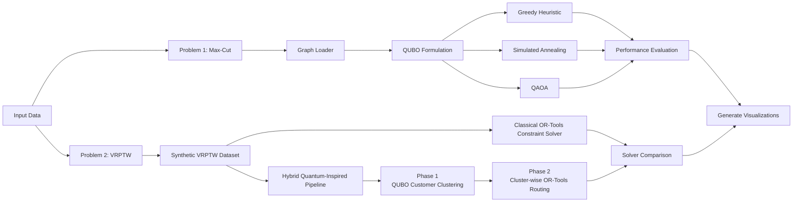
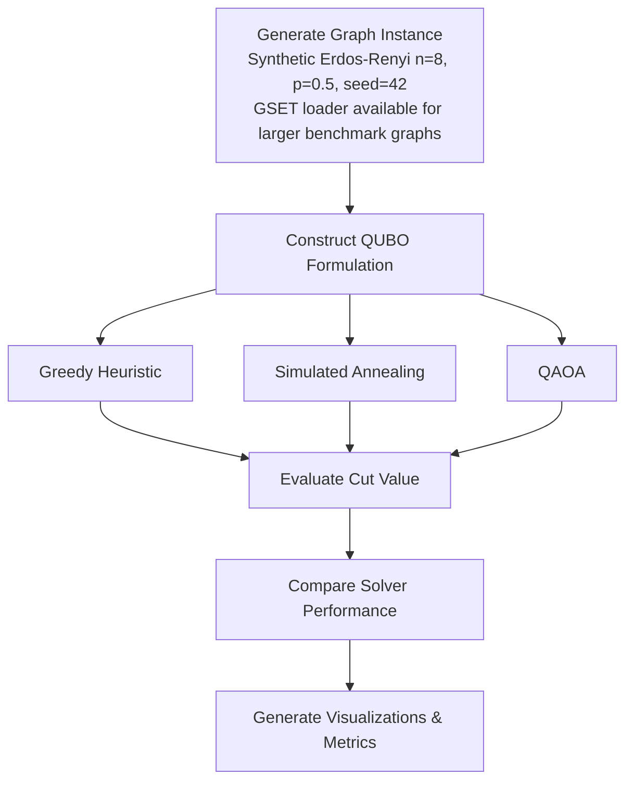
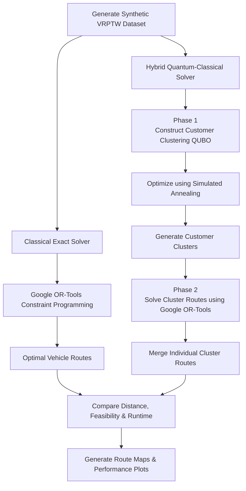

# QAIG Optimization Screening

> Hybrid Quantum Optimization using **Qiskit**, **QUBO**, **QAOA**, **Simulated Annealing**, and **Google OR-Tools**

## Overview

This repository contains my submission for the QAIG (TheQuantum.ai) Optimization Screening Assignment.

The project addresses two NP-hard optimization problems:

1. **Maximum Cut (Max-Cut)** using classical, quantum-inspired, and gate-based quantum approaches.
2. **Vehicle Routing Problem with Time Windows (VRPTW)** using a hybrid quantum-classical workflow.

The implementation emphasizes clean software architecture, modularity, reproducibility, and explainable engineering decisions. All experiments use a fixed random seed (**42**), centrally defined in `config.py`, so every reported result is exactly reproducible by re-running `main.py`.

---

# Repository Structure

```text
Qaig_optimization_screening/
│
├── README.md
├── main.py
├── __init__.py
├── config.py
├── Report.pdf
├── requirements.txt
├── pytest.ini
│
├── src/
│   ├── maxcut/
│   │    ├── __init__.py
│   │    ├── formulations.py
│   │    ├── qaoa.py
│   │    ├── sa.py
│   │    └── classical.py
│   │
│   ├── vrptw/
│   │    ├── __init__.py
│   │    ├── dataset.py
│   │    ├── ortools_solver.py
│   │    └──  hybrid_solver.py
│   │
│   └── utils/
│   │    ├── __init__.py
│   │    └── visualization.py
│
├── tests/
│   │    ├── test_maxcut.py
│   │    └── test_vrptw.py
├── data/
└── outputs/
```

---

# Overall Workflow



---
# Problem 1 - Maximum Cut (Max-Cut)

## Objective

The Maximum Cut (Max-Cut) problem aims to partition the vertices of an undirected weighted graph into two disjoint sets such that the total weight of edges crossing the partition is maximized.

Since Max-Cut is an NP-hard combinatorial optimization problem, this repository evaluates multiple optimization paradigms ranging from classical heuristics to quantum-inspired and gate-based quantum algorithms.

---

## Problem Formulation

Given an undirected weighted graph

G=(V,E),


the Max-Cut objective is formulated as a Quadratic Unconstrained Binary Optimization (QUBO) problem.

Let

$x_i \in \{0,1\}$

denote the partition assignment of vertex \(i\).

The QUBO objective is: 

$\min
\sum_{(i,j)\in E}
W_{ij}
\left(
2x_ix_j-x_i-x_j
\right)$, which is equivalent to maximizing the cut weight.

The QUBO is further mapped to an Ising Hamiltonian using:

$s_i=2x_i-1$,


allowing the problem to be solved using both quantum-inspired optimization techniques and gate-based quantum algorithms.

---

## Solution Overview

The repository formulates the Max-Cut problem as a QUBO and evaluates multiple optimization strategies on the same graph instance.

Each solver operates independently on the common QUBO formulation, enabling a direct comparison of solution quality and optimization performance.

---

## Solution Pipeline



> **Note:** The default pipeline (`main.py`) generates a small synthetic Erdős–Rényi graph (8 nodes, 16 edges, p = 0.5, seed = 42) rather than loading a GSET file. `formulations.py` includes a ready-to-use GSET-format loader (`load_gset_graph()`), but formal benchmarking against the full GSET suite (e.g., G1, G14, G22, G55) and published Toshiba Digital Annealer results was not executed for this submission — see **Future Improvements**.

---

## Optimization Algorithms

### Greedy Heuristic

A classical local-search heuristic is used as a computationally inexpensive baseline.

The algorithm begins with an initial partition and iteratively flips vertex assignments whenever the cut value improves.

Although computationally efficient, the greedy strategy may converge to local optima.

---

### Simulated Annealing

The QUBO formulation is optimized using **D-Wave Ocean's Simulated Annealing Sampler**, providing a quantum-inspired optimization approach.

The implementation employs:

- **1000 reads**
- **1000 sweeps**

to improve exploration of the solution space and obtain high-quality partitions.

---

### Quantum Approximate Optimization Algorithm (QAOA)

The repository implements a gate-based quantum solution using **Qiskit**.

The Ising Hamiltonian derived from the QUBO is used as the cost operator for a QAOA ansatz with:

- QAOA depth (p = 2)
- COBYLA optimizer
- Maximum 50 optimization iterations

The optimized quantum circuit is simulated, and the most probable measurement outcome is selected as the Max-Cut solution.

---

## Generated Outputs

The Max-Cut pipeline automatically generates:

| Output | Description |
|---------|-------------|
| `maxcut_sa_output.png` | Best graph partition obtained using Simulated Annealing |
| `maxcut_qaoa_convergence.png` | QAOA optimization convergence over iterations |
| `maxcut_qaoa_probs.png` | Measurement probability distribution of QAOA bitstrings |
| `qaoa_quantum_circuit.png` | Quantum circuit used for the QAOA implementation |
| `final_solver_comparisons.png` | Overall comparison of Max-Cut and VRPTW solver performance |

---

## Experimental Results

The demonstration instance is small enough (8 nodes, 16 edges) to brute-force enumerate all $2^8 = 256$ possible partitions, which confirms a **global optimum cut of 13**, achieved by exactly 2 of the 256 partitions. This ground truth is used below to assess how close each solver gets to the true optimum.

| Solver | Cut Value | Reached Global Optimum? |
|---------|----------:|:---:|
| Brute-Force (ground truth) | 13 | — |
| Greedy Heuristic | 13 | Yes |
| Simulated Annealing | 13 | Yes |
| QAOA (p = 2) | 10 | No |

---

## Results Discussion

The experimental observations demonstrate the strengths and limitations of each optimization approach.

- A brute-force enumeration of all 256 possible partitions on this 8-node instance confirms that 13 is the true global optimum, reached by only 2 of the 256 partitions — providing an independent ground truth against which the Greedy and Simulated Annealing results are validated.

- The **Greedy Heuristic** provides a fast baseline solution with minimal computational overhead.

- **Simulated Annealing** consistently produces solutions comparable to the greedy approach while offering better exploration of the optimization landscape through probabilistic search.

- **QAOA** successfully demonstrates the complete hybrid quantum optimization workflow, including QUBO formulation, Ising mapping, parameter optimization, and quantum circuit execution.

- For the benchmark graph considered in this project, the shallow QAOA circuit (\(p=2\)) achieves a lower cut value (10, a 76.9% approximation ratio) than the classical and quantum-inspired approaches, reflecting the current limitations of near-term gate-based quantum optimization.

---

## Key Takeaways

- A common QUBO formulation enables fair comparison across multiple optimization paradigms.

- Brute-force verification on small instances (e.g., this 8-node demonstration graph) confirms that Greedy and Simulated Annealing reach the true global optimum, not just a locally good solution.

- Simulated Annealing serves as an effective quantum-inspired optimizer for small and medium-sized Max-Cut instances.

- QAOA illustrates the complete hybrid quantum optimization workflow implemented with Qiskit.

- The repository provides a modular framework for benchmarking classical, quantum-inspired, and gate-based quantum optimization techniques on combinatorial graph problems.
---
# Problem 2 - Vehicle Routing with Time Windows (VRPTW)

## Objective

The Vehicle Routing Problem with Time Windows (VRPTW) aims to determine a set of optimal delivery routes that minimize the total travel distance while satisfying several operational constraints.

Each vehicle must:

- satisfy vehicle capacity limits,
- serve every customer exactly once,
- respect customer demand,
- complete deliveries within the specified service time windows.

Since VRPTW is an NP-hard combinatorial optimization problem, the repository implements **both a classical exact baseline** and a **hybrid quantum-classical optimization workflow** to evaluate the effectiveness of quantum-inspired optimization techniques.

---

## Pipeline


---

## Problem Formulation

The problem consists of a single depot and multiple geographically distributed customers.

Each customer is characterized by:

- Cartesian coordinates
- Demand
- Service time
- Time window $[a_i,b_i]$

The objective is to minimize the overall routing cost while satisfying capacity and scheduling constraints.

---

## Solution Overview

The implementation consists of **two complementary solution pipelines**.

### 1. Classical Baseline (Exact Solver)

The first pipeline serves as the benchmark solution.

Google **OR-Tools** directly solves the complete VRPTW instance using its routing engine with:

- Capacity constraints
- Time-window constraints
- Distance minimization objective

The resulting solution provides the reference routing cost against which the hybrid approach is evaluated.

---

### 2. Hybrid Quantum-Classical Workflow

Instead of attempting to encode the complete VRPTW into a single QUBO—which quickly becomes impractical for current quantum hardware, the problem is decomposed into two sequential optimization stages.

#### Phase 1 - Customer Clustering using QUBO

Customers are first assigned to vehicle clusters by solving a Quadratic Unconstrained Binary Optimization (QUBO) problem.

Let,
$y_{i,v}\in\{0,1\}$


represent whether customer \(i\) is assigned to vehicle \(v\).

The objective combines:

- **Distance Cost**: 

$\sum_{i<j}\sum_v d_{ij}y_{i,v}y_{j,v}$


which encourages geographically nearby customers to belong to the same cluster,

and

 - **Assignment Penalty** : $\alpha\left(\sum_v y_{i,v}-1\right)^2$,
with
$\alpha=2500$,

ensuring that every customer is assigned to exactly one vehicle.

The resulting QUBO is optimized using **D-Wave Ocean's Simulated Annealing Sampler**, producing spatial customer clusters.

The clustering output is visualized in

- `vrptw_phase1_clusters.png`

---

#### Phase 2 - Route Optimization

Once the customer clusters have been determined, each cluster is treated as an independent routing subproblem.

Google OR-Tools is then applied separately to each cluster while enforcing:

- vehicle capacity constraints,
- service time windows,
- depot start/end conditions.

The optimized cluster routes are subsequently merged to obtain the complete hybrid routing solution.

---

## Generated Outputs

The VRPTW pipeline automatically produces the following figures:

| Output | Description |
|---------|-------------|
| `vrptw_phase1_clusters.png` | Customer clusters obtained from QUBO optimization |
| `vrptw_exact_output.png` | Routes generated by the classical OR-Tools solver |
| `vrptw_hybrid_output.png` | Routes generated by the hybrid quantum-classical workflow |
| `final_solver_comparisons.png` | Side-by-side comparison of classical and hybrid solver performance |

---

## Experimental Results

The generated synthetic benchmark consists of:

- 10 customers
- 6 delivery vehicles
- Vehicle capacity constraints
- Randomly generated customer demands and delivery time windows

The obtained routing distances are approximately

| Solver | Total Distance |
|---------|---------------:|
| Classical OR-Tools | **≈ 410** |
| Hybrid Quantum-Classical | **≈ 630** |

---

## Results Discussion

The experimental observations are consistent with expectations for current hybrid optimization methods.

- The classical OR-Tools solver produces the lowest routing cost by optimizing the complete problem globally.
- The hybrid approach first partitions customers into spatially coherent clusters before solving each routing subproblem independently.
- Although this decomposition introduces some loss of global optimality, it significantly reduces the optimization complexity and illustrates a practical near-term quantum optimization workflow.
- The clustering stage demonstrates how quantum-inspired optimization techniques can be integrated into larger combinatorial optimization pipelines.
- Both approaches satisfy all vehicle capacity and customer time-window constraints.

---

## Key Takeaways

- Google OR-Tools serves as the exact benchmark for solution quality.
- The hybrid quantum-classical solver demonstrates a scalable decomposition strategy for large routing problems.
- QUBO-based customer clustering reduces search complexity while maintaining feasible routing solutions.
- This workflow represents a realistic application of quantum-inspired optimization in the NISQ era, where quantum techniques complement rather than replace high-performance classical solvers.
---

# Running the Project

## 1. Clone the Repository

```bash
git clone https://github.com/Prashik123/Qaig_optimization_screening.git
cd Qaig_optimization_screening
```

---

## 2. Create a Virtual Environment

### Windows (PowerShell / Command Prompt)

```powershell
python -m venv .venv
.\.venv\Scripts\activate
```

### Linux / macOS

```bash
python3 -m venv .venv
source .venv/bin/activate
```

---

## 3. Install Dependencies

```bash
pip install -r requirements.txt
```

---

## 4. Execute the Complete Pipeline

Run the following command to execute both the **Max-Cut** and **VRPTW** optimization pipelines:

```bash
python main.py
```

The program will:

- Execute the Max-Cut benchmark
- Execute the Classical OR-Tools VRPTW solver
- Execute the Hybrid Quantum-Classical VRPTW solver
- Generate all visualizations
- Save the outputs in the `outputs/` directory

---

## 5. Run Unit Tests

To verify that the individual modules are functioning correctly, execute:

```bash
pytest
```

or

```bash
pytest tests/
```

---

# Outputs

Generated figures are stored under `outputs/`.

Typical outputs include

- Max-Cut graph visualization
- Solver comparison plots
- QAOA convergence
- VRPTW customer distribution
- Route visualization
- Performance metrics

---

# Conclusions

## Max-Cut

This project demonstrates the progression from classical exact optimization to quantum-inspired and gate-based quantum algorithms.

Brute Force establishes the optimum for small instances, Greedy provides a rapid baseline, Simulated Annealing offers a strong heuristic, and QAOA illustrates the hybrid quantum workflow implemented in Qiskit.

## VRPTW

A fully quantum formulation of VRPTW remains beyond the capability of present-day gate-based hardware for practical problem sizes. Consequently, a hybrid decomposition strategy combining customer clustering with OR-Tools routing offers a pragmatic and scalable alternative.

---

# Future Improvements

- IBM Runtime execution
- Hardware-aware transpilation (Deploying Error suppresion and mitigation techniques)
- Recursive QAOA
- Larger benchmark datasets
- Adaptive clustering
- D-Wave comparison (Ocean - SDK)
- GSET benchmark suite execution (G1, G14, G22, G55) with results compared against published Toshiba Digital Annealer figures
- Resolve known test/config drift in the clustering QUBO penalty test (stale α assertion vs. production value)
