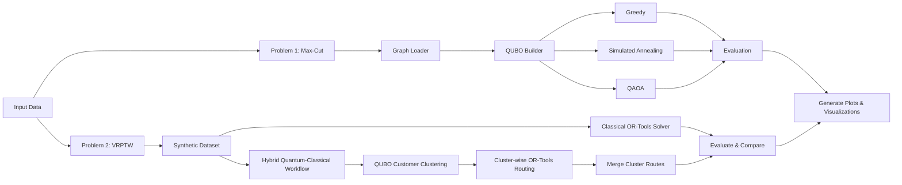
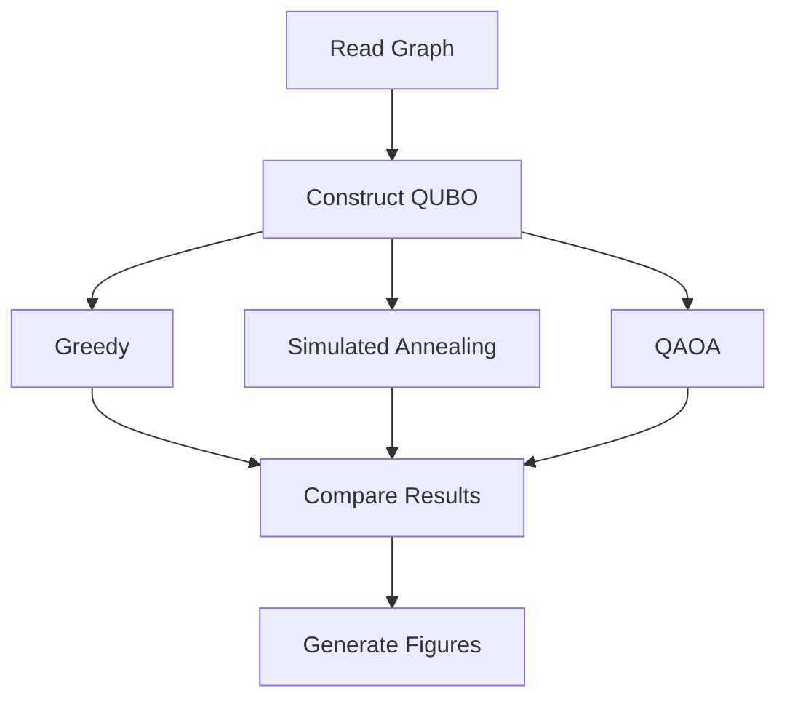
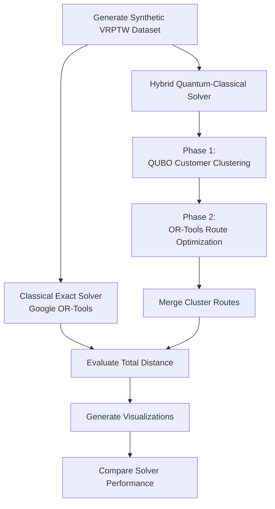

# QAIG Optimization Screening

> Hybrid Quantum Optimization using **Qiskit**, **QUBO**, **QAOA**, **Simulated Annealing**, and **Google OR-Tools**

## Overview

This repository contains my submission for the QAIG (TheQuantum.ai) Optimization Screening Assignment.

The project addresses two NP-hard optimization problems:

1. **Maximum Cut (Max-Cut)** using classical, quantum-inspired, and gate-based quantum approaches.
2. **Vehicle Routing Problem with Time Windows (VRPTW)** using a hybrid quantum-classical workflow.

The implementation emphasizes clean software architecture, modularity, reproducibility, and explainable engineering decisions.

---

# Repository Structure

```text
Qaig_optimization_screening/
│
├── README.md
├── main.py
├── __init__.py
├── config.py
├── report.pdf
├── requirements.txt
├── pytest.ini
│
├── src/
│   ├── maxcut/
│   │    ├── __init__.py
│   │    ├── formulations.py
│   │    ├── qaoa.py
│   │    ├── sa.py
│   │    └── classical.py
│   │
│   ├── vrptw/
│   │    ├── __init__.py
│   │    ├── dataset.py
│   │    ├── ortools_solver.py
│   │    └──  hybrid_solver.py
│   │
│   └── utils/
│   │    ├── __init__.py
│   │    └── visualization.py
│
├── tests/
│   │    ├── test_maxcut.py
│   │    └── test_vrptw.py
├── data/
└── outputs/
```

---

# Overall Workflow


---

# Problem 1 — Max-Cut

## Objective

Partition graph vertices into two sets while maximizing edge weights crossing the partition.

## Pipeline



## Solvers

| Solver | Purpose |
|---------|----------|
| Greedy | Fast heuristic baseline |
| Brute Force | Exact solution for small graphs |
| Simulated Annealing | Quantum-inspired optimizer |
| QAOA | Gate-based quantum optimizer |

## Results Discussion

The implementation compares solution quality and runtime across all four solvers.

Observations:

- Brute Force produces the optimal cut for small graphs.
- Greedy is extremely fast but can become trapped in local optima.
- Simulated Annealing consistently improves over greedy while remaining computationally inexpensive.
- QAOA demonstrates the workflow of hybrid quantum optimization. On small simulator-based instances its solution quality is competitive, although runtime is dominated by circuit execution and parameter optimization.

These observations are consistent with current NISQ-era quantum optimization, where hybrid algorithms demonstrate promise but do not yet outperform classical exact solvers on small benchmarks.

---
# Problem 2 — Vehicle Routing with Time Windows (VRPTW)

## Objective

The Vehicle Routing Problem with Time Windows (VRPTW) aims to determine a set of optimal delivery routes that minimize the total travel distance while satisfying several operational constraints.

Each vehicle must:

- satisfy vehicle capacity limits,
- serve every customer exactly once,
- respect customer demand,
- complete deliveries within the specified service time windows.

Since VRPTW is an NP-hard combinatorial optimization problem, the repository implements **both a classical exact baseline** and a **hybrid quantum-classical optimization workflow** to evaluate the effectiveness of quantum-inspired optimization techniques.

---

## Problem Formulation

The problem consists of a single depot and multiple geographically distributed customers.

Each customer is characterized by:

- Cartesian coordinates
- Demand
- Service time
- Time window \([a_i,b_i]\)

The objective is to minimize the overall routing cost while satisfying capacity and scheduling constraints.

---

## Solution Overview

The implementation consists of **two complementary solution pipelines**.

### 1. Classical Baseline (Exact Solver)

The first pipeline serves as the benchmark solution.

Google **OR-Tools** directly solves the complete VRPTW instance using its routing engine with:

- Capacity constraints
- Time-window constraints
- Distance minimization objective

The resulting solution provides the reference routing cost against which the hybrid approach is evaluated.

---

### 2. Hybrid Quantum-Classical Workflow

Instead of attempting to encode the complete VRPTW into a single QUBO—which quickly becomes impractical for current quantum hardware, the problem is decomposed into two sequential optimization stages.

#### Phase 1 - Customer Clustering using QUBO

Customers are first assigned to vehicle clusters by solving a Quadratic Unconstrained Binary Optimization (QUBO) problem.

Let,
$y_{i,v}\in\{0,1\}$


represent whether customer \(i\) is assigned to vehicle \(v\).

The objective combines:

- **Distance Cost**: 

$\sum_{i<j}\sum_v d_{ij}y_{i,v}y_{j,v}$


which encourages geographically nearby customers to belong to the same cluster,

and

- **Assignment Penalty**

$\alpha\left(\sum_v y_{i,v}-1\right)^2$,
with


$\alpha=2500$,

ensuring that every customer is assigned to exactly one vehicle.

The resulting QUBO is optimized using **D-Wave Ocean's Simulated Annealing Sampler**, producing spatial customer clusters.

The clustering output is visualized in

- `vrptw_phase1_clusters.png`

---

#### Phase 2 - Route Optimization

Once the customer clusters have been determined, each cluster is treated as an independent routing subproblem.

Google OR-Tools is then applied separately to each cluster while enforcing:

- vehicle capacity constraints,
- service time windows,
- depot start/end conditions.

The optimized cluster routes are subsequently merged to obtain the complete hybrid routing solution.

---

## Overall Execution Pipeline

The implementation executes **both solution strategies** and compares their performance.



---

## Generated Outputs

The VRPTW pipeline automatically produces the following figures:

| Output | Description |
|---------|-------------|
| `vrptw_phase1_clusters.png` | Customer clusters obtained from QUBO optimization |
| `vrptw_exact_output.png` | Routes generated by the classical OR-Tools solver |
| `vrptw_hybrid_output.png` | Routes generated by the hybrid quantum-classical workflow |
| `final_solver_comparisons.png` | Side-by-side comparison of classical and hybrid solver performance |

---

## Experimental Results

The generated synthetic benchmark consists of:

- 10 customers
- 6 delivery vehicles
- Vehicle capacity constraints
- Randomly generated customer demands and delivery time windows

The obtained routing distances are approximately

| Solver | Total Distance |
|---------|---------------:|
| Classical OR-Tools | **≈ 410** |
| Hybrid Quantum-Classical | **≈ 630** |

---

## Results Discussion

The experimental observations are consistent with expectations for current hybrid optimization methods.

- The classical OR-Tools solver produces the lowest routing cost by optimizing the complete problem globally.

- The hybrid approach first partitions customers into spatially coherent clusters before solving each routing subproblem independently.

- Although this decomposition introduces some loss of global optimality, it significantly reduces the optimization complexity and illustrates a practical near-term quantum optimization workflow.

- The clustering stage demonstrates how quantum-inspired optimization techniques can be integrated into larger combinatorial optimization pipelines.

- Both approaches satisfy all vehicle capacity and customer time-window constraints.

---

## Key Takeaways

- Google OR-Tools serves as the exact benchmark for solution quality.

- The hybrid quantum-classical solver demonstrates a scalable decomposition strategy for large routing problems.

- QUBO-based customer clustering reduces search complexity while maintaining feasible routing solutions.

- This workflow represents a realistic application of quantum-inspired optimization in the NISQ era, where quantum techniques complement rather than replace high-performance classical solvers.
---

# Outputs

Generated figures are stored under `outputs/`.

Typical outputs include

- Max-Cut graph visualization
- Solver comparison plots
- QAOA convergence
- VRPTW customer distribution
- Route visualization
- Performance metrics

---

# Conclusions

## Max-Cut

This project demonstrates the progression from classical exact optimization to quantum-inspired and gate-based quantum algorithms.

Brute Force establishes the optimum for small instances, Greedy provides a rapid baseline, Simulated Annealing offers a strong heuristic, and QAOA illustrates the hybrid quantum workflow implemented in Qiskit.

## VRPTW

A fully quantum formulation of VRPTW remains beyond the capability of present-day gate-based hardware for practical problem sizes. Consequently, a hybrid decomposition strategy combining customer clustering with OR-Tools routing offers a pragmatic and scalable alternative.

---

# Future Improvements

- IBM Runtime execution
- Hardware-aware transpilation
- Recursive QAOA
- Larger benchmark datasets
- Parallel optimization
- Adaptive clustering
- D-Wave comparison
- Performance profiling


