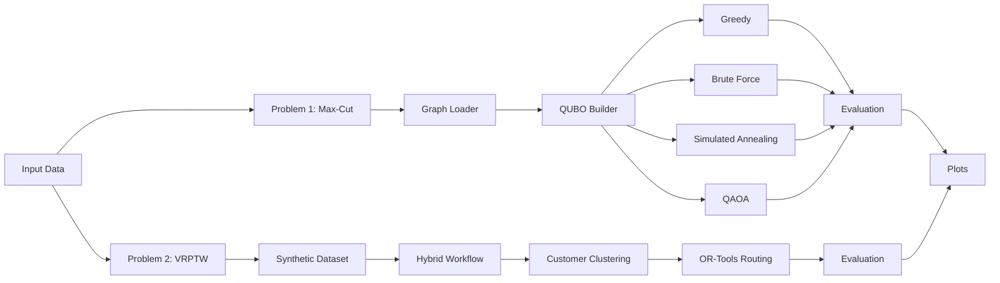
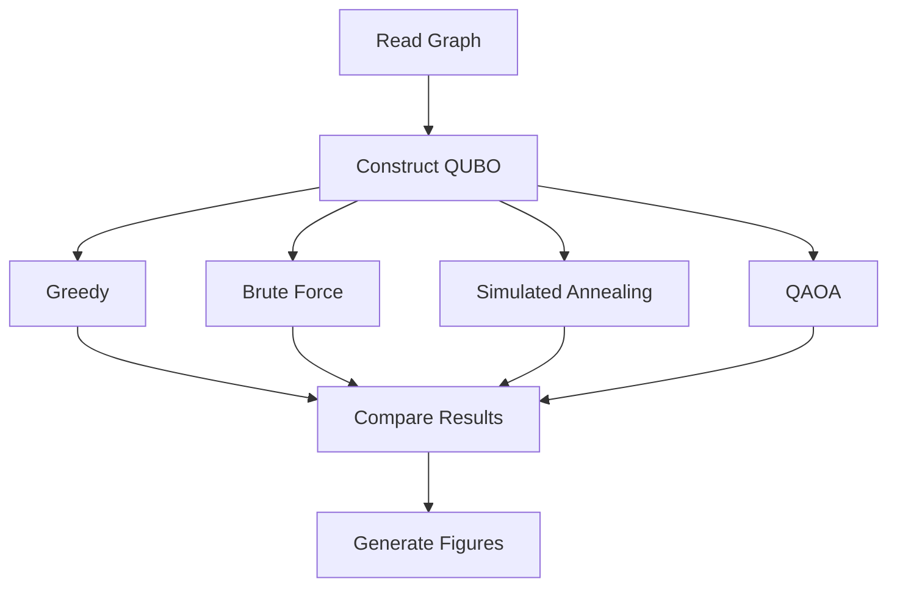
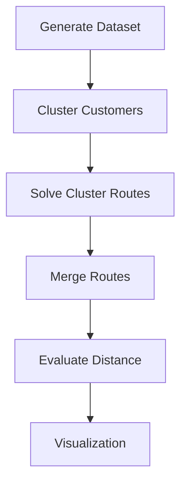

# QAIG Optimization Screening

> Hybrid Quantum Optimization using **Qiskit**, **QUBO**, **QAOA**, **Simulated Annealing**, and **Google OR-Tools**

## Overview

This repository contains my submission for the QAIG (TheQuantum.ai) Optimization Screening Assignment.

The project addresses two NP-hard optimization problems:

1. **Maximum Cut (Max-Cut)** using classical, quantum-inspired, and gate-based quantum approaches.
2. **Vehicle Routing Problem with Time Windows (VRPTW)** using a hybrid quantum-classical workflow.

The implementation emphasizes clean software architecture, modularity, reproducibility, and explainable engineering decisions.

---

# Repository Structure

```text
Qaig_optimization_screening/
│
├── README.md
├── main.py
├── config.py
├── requirements.txt
├── pytest.ini
│
├── src/
│   ├── maxcut/
│   │    ├── qubo.py
│   │    ├── qaoa_solver.py
│   │    ├── simulated_annealing.py
│   │    ├── classical.py
│   │    └── metrics.py
│   │
│   ├── vrptw/
│   │    ├── dataset.py
│   │    ├── ortools_solver.py
│   │    ├── hybrid_solver.py
│   │    └── clustering.py
│   │
│   └── utils/
│        └── visualization.py
│
├── tests/
├── data/
└── outputs/
```

---

# Overall Workflow



---

# Problem 1 — Max-Cut

## Objective

Partition graph vertices into two sets while maximizing edge weights crossing the partition.

## Pipeline



## Solvers

| Solver | Purpose |
|---------|----------|
| Greedy | Fast heuristic baseline |
| Brute Force | Exact solution for small graphs |
| Simulated Annealing | Quantum-inspired optimizer |
| QAOA | Gate-based quantum optimizer |

## Results Discussion

The implementation compares solution quality and runtime across all four solvers.

Observations:

- Brute Force produces the optimal cut for small graphs.
- Greedy is extremely fast but can become trapped in local optima.
- Simulated Annealing consistently improves over greedy while remaining computationally inexpensive.
- QAOA demonstrates the workflow of hybrid quantum optimization. On small simulator-based instances its solution quality is competitive, although runtime is dominated by circuit execution and parameter optimization.

These observations are consistent with current NISQ-era quantum optimization, where hybrid algorithms demonstrate promise but do not yet outperform classical exact solvers on small benchmarks.

---

# Problem 2 — VRPTW

## Objective

Minimize total travel distance while satisfying

- vehicle capacities
- customer demands
- service time windows

## Hybrid Workflow



## Classical Baseline

Google OR-Tools provides the benchmark solution.

## Hybrid Strategy

Instead of encoding the complete VRPTW into one QUBO (currently impractical for gate-based quantum hardware), the workflow:

1. clusters geographically similar customers,
2. optimizes each cluster independently,
3. combines the resulting routes.

This decomposition significantly reduces optimization complexity while illustrating how quantum optimization can complement classical routing.

## Results Discussion

Key observations include:

- OR-Tools consistently provides the best feasible routing solution.
- The hybrid approach demonstrates a scalable decomposition strategy.
- Customer clustering reduces search complexity and creates independent optimization subproblems.
- Although not globally optimal, the hybrid solution illustrates a realistic near-term quantum workflow.

---

# Engineering Decisions

- Modular package layout for maintainability.
- Configuration separated from algorithms.
- Visualization isolated from optimization logic.
- Independent solver implementations enable benchmarking.
- Tests validate individual modules.

---

# Running the Project

```bash
python -m venv .venv

source .venv/bin/activate

pip install -r requirements.txt

python main.py
```

Run tests

```bash
pytest
```

---

# Outputs

Generated figures are stored under `outputs/`.

Typical outputs include

- Max-Cut graph visualization
- Solver comparison plots
- QAOA convergence
- VRPTW customer distribution
- Route visualization
- Performance metrics

---

# Conclusions

## Max-Cut

This project demonstrates the progression from classical exact optimization to quantum-inspired and gate-based quantum algorithms.

Brute Force establishes the optimum for small instances, Greedy provides a rapid baseline, Simulated Annealing offers a strong heuristic, and QAOA illustrates the hybrid quantum workflow implemented in Qiskit.

## VRPTW

A fully quantum formulation of VRPTW remains beyond the capability of present-day gate-based hardware for practical problem sizes. Consequently, a hybrid decomposition strategy combining customer clustering with OR-Tools routing offers a pragmatic and scalable alternative.

---

# Future Improvements

- IBM Runtime execution
- Hardware-aware transpilation
- Recursive QAOA
- Larger benchmark datasets
- Parallel optimization
- Adaptive clustering
- D-Wave comparison
- Performance profiling

---

# Discussion Points for QAIG Interview

- Why QUBO?
- Why QAOA instead of VQE?
- Why Simulated Annealing?
- Why OR-Tools?
- Why hybrid decomposition?
- Scalability limitations?
- Current quantum hardware constraints?
- How would this scale to hundreds of customers?

These design choices reflect practical optimization engineering rather than attempting to replace mature classical solvers with quantum algorithms where current hardware is not yet competitive.
